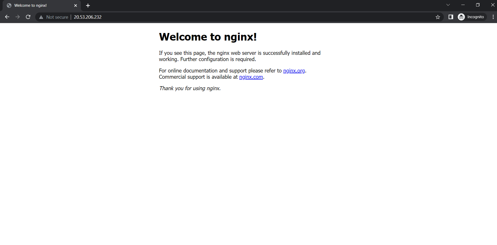

# Kubernetes cluster on Azure using Terraform

## Terraform

Terraform is an open-source infrastructure as code software tool which uses cloud APIs into declarative configuration files. It has strong support for many cloud providers and smoothly automates infrastructure provisioning. Download it from [here](https://www.terraform.io/downloads).

## Azure CLI 

To interact with Azure we need Azure CLI. There are 4 ways to get it installed. Choose any one of them according to use-case from `configuration` point mentioned in the [official documentation](https://docs.microsoft.com/en-us/azure/developer/terraform/create-linux-virtual-machine-with-infrastructure).

Another clean alternative is using [Docker Hub](https://hub.docker.com/_/microsoft-azure-cli). This doesn't require installing anythinng on your machine and you can install other dependencies like terrraform in it. This approach is suitable for quick run or short term use-case.

```
# Run Azure CLI
docker run -it --rm -v ${PWD}:/work -w /work --entrypoint /bin/sh mcr.microsoft.com/azure-cli:2.30.0
```

# Getting Started

## Login to Azure

Create an account on [Azure](https://azure.microsoft.com/en-in/). Any free-trial subscription or student subscription is sufficient. 

Log in to azure cli using
```
#login and follow prompts
az login 
```

For further use we need tenant-id and subscription details.


Grab the tenant-id from from ``az login`` output and store it in the environment variable.

For windows 
```
$env:TENANT_ID=<tenant-id>
```
For Linux 
```
$TENANT_ID=<tenant-id>
```

Further documentation will be according to windows conventions. Make appropriate changes in case of Linux for environment variables.

Set subscription environemnt variable.

```
# view and select your subscription account

az account list -o table

$env:SUBSCRIPTION=<id>

# set subscription to run az commands 

az account set --subscription $env:SUBSCRIPTION
```

# Create a Service Principal

Kubernetes needs a service account to manage our Kubernetes cluster. Also to interact with azure using azure-cli or terraform a Service Principal is required. It is simply like a service account to which we can assign roles to interact with the azure infrastructure.

Create a service principal and store required information in the enviornment variables.

```
# create a service principal
az ad sp create-for-rbac --skip-assignment --name aks-getting-started-sp

# set enviornment variable from the values from the output of previous command. 
$env:SERVICE_PRINCIPAL=<appId>
$env:SERVICE_PRINCIPAL_SECRET=<password>

#note: reset the credential if you have any sinlge or double quote on password
az ad sp credential reset --name "aks-getting-started-sp"

# Grant contributor role over the subscription to our service principal

az role assignment create --assignee $SERVICE_PRINCIPAL \
--scope "/subscriptions/$SUBSCRIPTION" \
--role Contributor
```

# Generate SSH Key
Generate a SSH Key if you don't have one. Store the public key in an enviornment variable
```
ssh-keygen -t rsa -b 4096 -N "StrongPassPhrase@159!" -C "email_id@example.com"
```

For windows 
```
$env:SSH_KEY=$( cat C:\Users\<user-name>\.ssh\id_rsa.pub )
```

Provide appropriate location for ssh-keys according to your system. 

# Modules 

The main module contains the terraform and azurerm definitions. The source code of cluster and k8s and modules are defined in ``modules`` folder for better maintainance. Varibles are defined in ``variables.tf`` file and they are passed to the child modules.

``cluster`` module contains code for bringing up a kubernetes cluster. More information about it can be found [here](https://registry.terraform.io/providers/hashicorp/azurerm/latest/docs/resources/kubernetes_cluster).

The attributes that are exported by kubernets cluster are listed [here](https://registry.terraform.io/providers/hashicorp/azurerm/latest/docs/resources/kubernetes_cluster#attributes-reference). The outputs that we want to export are defined in the ``outputs.tf`` file in ``cluster`` module. This config contains variables to be used by [kubectl](https://kubernetes.io/docs/reference/kubectl/) and other compatible tools to bring up other kubernetes objects.

Finally, the ``k8s`` module contains a sample kubernetes deployments and services (these can be  from derived from yaml files used in kubernetes).

# Deploy using Terraform

```
# step-1
terraform init

# step-2
terraform plan -var serviceprinciple_id=$env:SERVICE_PRINCIPAL \
    -var serviceprinciple_key="$env:SERVICE_PRINCIPAL_SECRET" \
    -var tenant_id=$env:TENANT_ID \
    -var subscription_id=$env:SUBSCRIPTION \
    -var ssh_key="$env:SSH_KEY"

# step-3 
terraform apply -var serviceprinciple_id=$env:SERVICE_PRINCIPAL \
    -var serviceprinciple_key="$env:SERVICE_PRINCIPAL_SECRET" \
    -var tenant_id=$env:TENANT_ID \
    -var subscription_id=$env:SUBSCRIPTION \
    -var ssh_key="$env:SSH_KEY"
````

Sample output after ``terraform plan`` command :


# See what we deployed !

The deployments can be viewed on azure dashboard.

### aks-cluster


### k8s-deployments


### k8s-services


# Sample nginx pod running

### nginx pod


# Clean up

```
terraform destroy -var serviceprinciple_id=$env:SERVICE_PRINCIPAL \
    -var serviceprinciple_key="$env:SERVICE_PRINCIPAL_SECRET" \
    -var tenant_id=$env:TENANT_ID \
    -var subscription_id=$env:SUBSCRIPTION \
    -var ssh_key="$env:SSH_KEY"
```